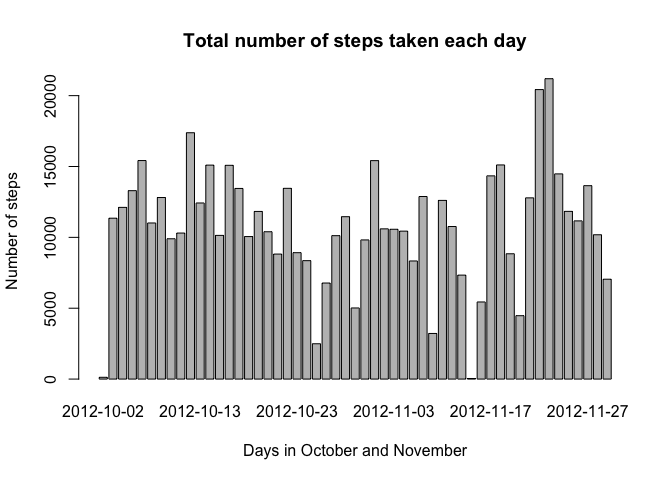
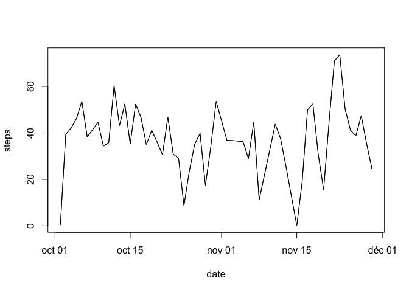
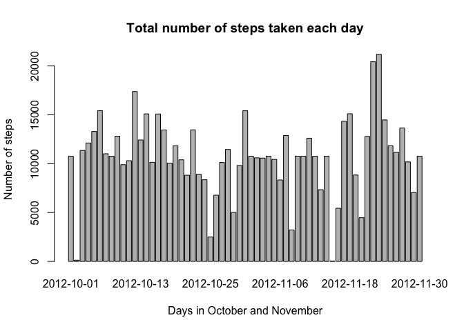
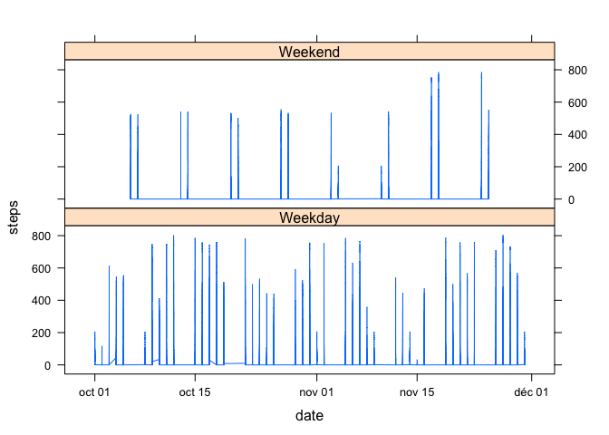

# Reproducible Research: Peer Assessment 1


## Loading and preprocessing the data
  
Unzip the activity file
  

```r
  unzip("activity.zip")
```

Loading the data with processing:


```r
  activity <- read.csv("activity.csv",header = TRUE)
  activity$date <- as.Date(as.character(activity$date))
```
  

## What is mean total number of steps taken per day?

Ignore the missing values:

```r
    activity_na <- na.omit(activity)
```

Histogram of the total number of steps taken each day:

```r
    activity_hist <- aggregate(steps ~ date,activity_na ,FUN=sum)
    barplot(activity_hist$steps, main = "Total number of steps taken each day",
      xlab = "Days in October and November",
      ylab = "Number of steps",
      names.arg = activity_hist$date)
```

<!-- -->

Mean and Median:


```r
    mean(activity_hist$steps)
```

```
## [1] 10766.19
```

```r
    median(activity_hist$steps)
```

```
## [1] 10765
```

## What is the average daily activity pattern?

Time series plot of the 5-minute interval


```r
    activity_ts <- aggregate(steps ~ date,activity_na ,FUN=mean)
    plot(activity_ts, type = "l")
    lines(activity_ts)
```

<!-- -->

The 5-minute interval, which contains the maximum


```r
which.max(activity$interval)
```

```
## [1] 288
```


## Imputing missing values

The total number of missing values in the dataset


```r
dim(activity)[1]-dim(activity_na)[1]
```

```
## [1] 2304
```


Though for the first day of the dataset, all the data are missing, it is interesting to fill missing values with the mean of corresponding 5-minute intervals for all days.
For doing that, we add a 4th column (the order of 5-minute intervals in a day)  and aggregate according to it.

The new dataset is : activity_filled


```r
activity_filled <- activity
activity_f <- activity
activity_f[["order"]] <- rep(1:288,61)

activity_f <- aggregate(steps ~ order,activity_f ,FUN=mean)
for (i in 1:nrow(activity_filled)) {
 if (is.na(activity_filled[i,1])) {
   if(i %% 288 == 0){
     activity_filled[i, 1] <- activity_f[288,2]
   } else {
         activity_filled[i, 1] <- activity_f[(i %% 288),2]
   }
  }
}
```


New histogram and new mean/median


```r
    activity_nhist <- aggregate(steps ~ date,activity_filled ,FUN=sum)
    barplot(activity_nhist$steps, main = "Total number of steps taken each day",
      xlab = "Days in October and November",
      ylab = "Number of steps",
      names.arg = activity_nhist$date)
```

<!-- -->

```r
    mean(activity_nhist$steps)
```

```
## [1] 10766.19
```

```r
    median(activity_nhist$steps)
```

```
## [1] 10766.19
```

It seems to have no influence.


## Are there differences in activity patterns between weekdays and weekends?


```r
day <- vector()
for (i in 1:nrow(activity_filled)) {
    if (weekdays(activity_filled[i,2]) == "Dimanche") {
        day[i] <- "Weekend"
    } else if (weekdays(activity_filled[i,2]) == "Samedi") {
        day[i] <- "Weekend"
    } else {
        day[i] <- "Weekday"
    }
}
activity_filled$day <- day
activity_filled$day <- factor(activity_filled$day)
```


```r
    library(lattice)
    xyplot(steps ~ date | day ,activity_filled, type = "l", layout = c(1, 2))
```

<!-- -->

